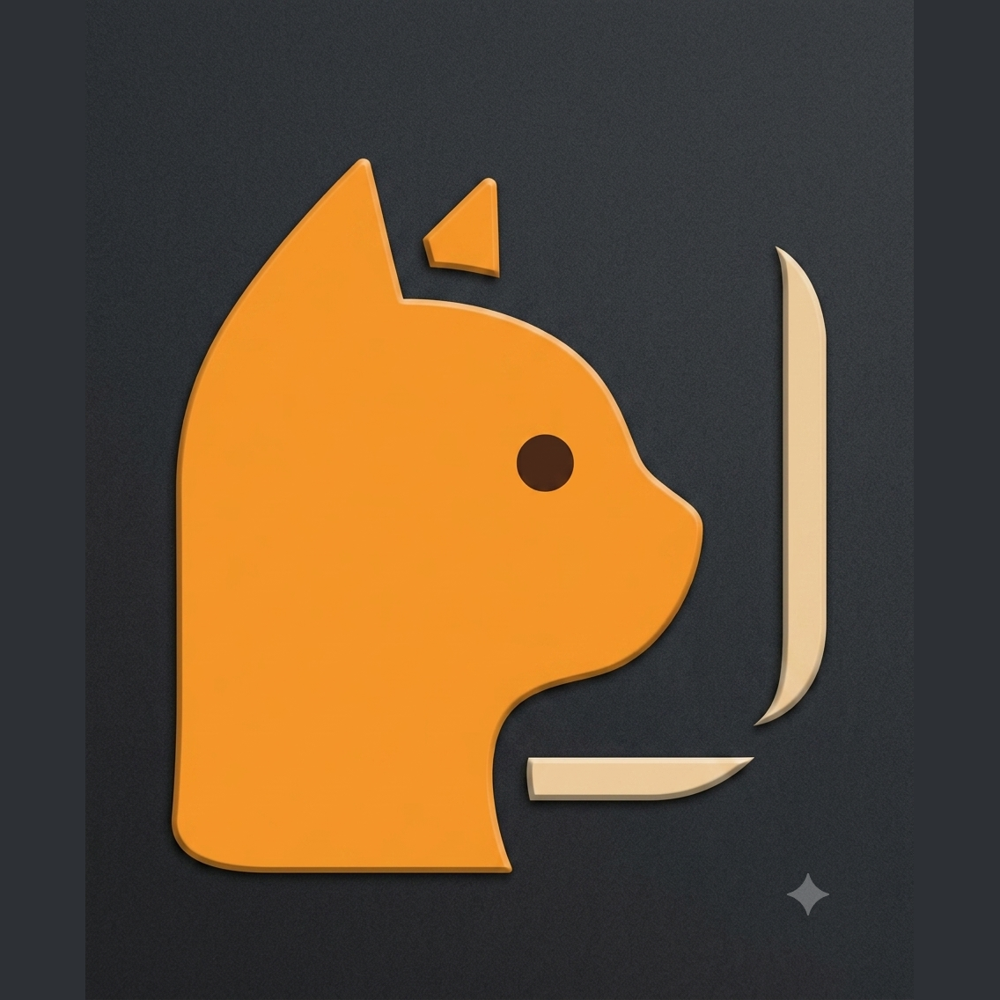
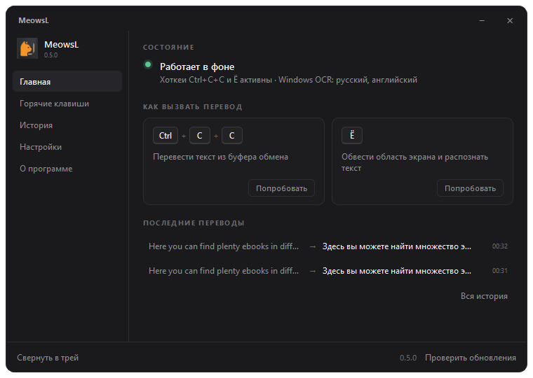
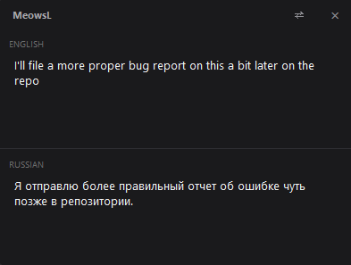

# MeowsL

<p align="center">
  
</p>
<p align="center">
  
</p>
<p align="center">
  
</p>

**MeowsL** — фоновый переводчик для Windows из системного трея. **Ctrl+C+C** — перевод из буфера; **Ё** — выдели текст на экране рамкой. Результат в компактном popup-окне.

## Возможности

- **Ctrl+C+C** — открыть перевод текста из буфера обмена
- **Ё** — выделить область на экране и перевести текст с картинки
- **Ctrl+Alt+T** — запасной хоткей
- Автоопределение языка: русский ↔ английский
- Редактирование исходного текста с debounce-переводом
- **⇄** — поменять тексты и направление перевода
- Копирование полей по иконке **⧉** или `Ctrl+C`
- Ресайз окна со всех сторон, запоминание позиции
- Закрытие по `Esc`, клику вне окна или кнопке **×**
- Главное окно: состояние, шпаргалка по хоткеям, история переводов, настройки
- История последних 50 переводов с копированием и повторным открытием
- Автозапуск с Windows — в настройках или в меню трея

## Главное окно

Окно открывается при ручном запуске программы и по клику на иконку в трее. Пять разделов:

| Раздел | Что там |
| --- | --- |
| **Главная** | Работают ли хоткеи и стоят ли OCR-пакеты, карточки вызова перевода, последние переводы |
| **Горячие клавиши** | Все хоткеи с их состоянием, перепривязка клавиши перевода с экрана, перезапуск от администратора |
| **История** | Последние 50 переводов по дням, копирование и повторное открытие |
| **Настройки** | Автозапуск, языковая пара, задержка перевода, язык OCR, поведение popup |
| **О программе** | Версия, проверка обновлений, диагностика окружения, ссылки |

Крестик **×** сворачивает окно в трей — программа продолжает работать. Выход только через пункт «Выход» в меню трея.

При автозапуске с Windows окно **не показывается**: в автозагрузку записывается команда с флагом `--tray`. Включить показ можно галочкой «Открывать это окно при запуске» в настройках.

## Быстрый старт

### Из исходников (нужен Python 3.10+)

```powershell
git clone https://github.com/MrMe0ws/MeowsL
cd MeowsL
py -3 -m pip install -r requirements.txt
py -3 main.py
```

Откроется главное окно, а иконка появится в системном трее. Окно перевода вызывается хоткеем.

> **Примечание:** на части систем глобальные хоткеи могут потребовать запуск от имени администратора.

### Готовый .exe

Скачай `MeowsL_<версия>.exe` (например `MeowsL_0.5.0.exe`) из [Releases](https://github.com/MrMe0ws/MeowsL/releases) и запусти. Python не нужен.

## Как пользоваться

1. Выделите текст в любом приложении и скопируйте (`Ctrl+C`).
2. Быстро нажмите `Ctrl+C` ещё раз — откроется окно MeowsL с переводом.
3. Можно править верхнее поле — перевод обновится автоматически.
4. Закройте окно через `Esc`, клик мимо окна или **×** — приложение останется в трее.

### Перевод с экрана (картинки, PDF, игры)

1. Нажмите **Ё** (физическая клавиша слева от `1`).
2. Зажмите левую кнопку мыши и обведите нужный текст рамкой.
3. Отпустите кнопку — MeowsL распознает текст и покажет перевод.
4. `Esc` во время выделения — отмена.

> Для распознавания используется встроенный Windows OCR. Какие языковые пакеты установлены, видно на вкладке «Настройки → Перевод с экрана» — там же выбирается язык распознавания. Проверка вручную в PowerShell: `Get-WindowsCapability -Online -Name "Language.OCR*"`.


## Стек

- Python 3.10+
- PyQt6 — интерфейс
- `deep_translator` / `requests` — Google Translate (с запасным MyMemory)
- `keyboard` — глобальные хоткеи Windows
- `winocr` + `Pillow` — захват и распознавание текста с экрана (Windows OCR)
- PyInstaller — сборка в exe

## Структура

```
MeowsL/
├── main.py              # Точка входа
├── photo/               # Логотип и скриншоты
├── build/               # Скрипты сборки
└── src/translate_meows/ # Исходный код
```

## Ограничения

- Только Windows 10+
- Нужен интернет для перевода
- `Ctrl+C+C` может пересекаться с быстрым двойным копированием
- Антивирус может предупреждать о неподписанном `.exe` (типично для PyInstaller)

